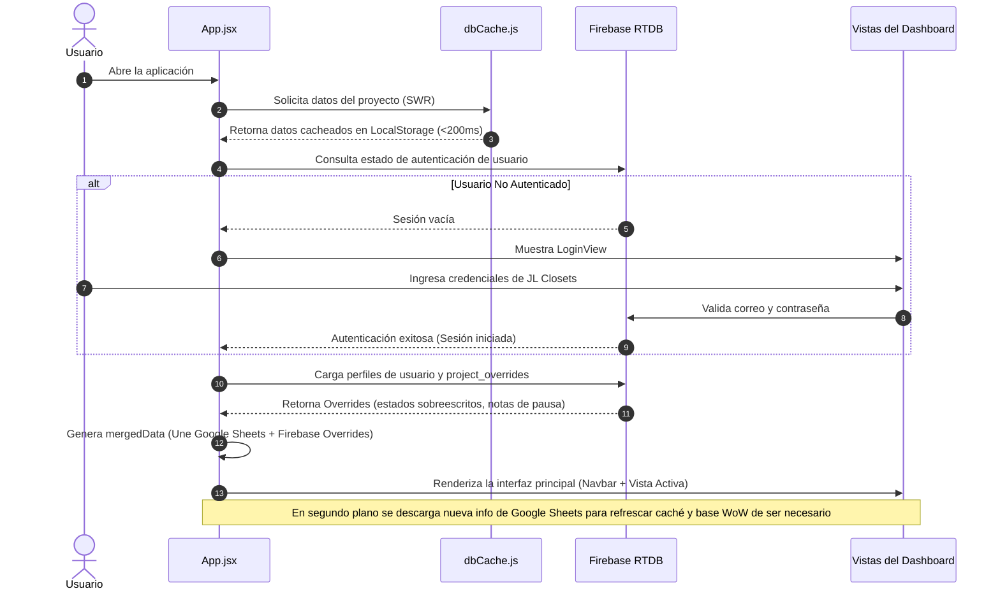

# Contexto Técnico y Flujo de la Aplicación (JL Closets KPI Dashboard)

Este documento detalla la arquitectura, el flujo de datos y la organización de la aplicación **JL Closets KPI Dashboard**, diseñada para el equipo de ingeniería y diseño.

---

## 1. Contexto del Proyecto

El JL Closets KPI Dashboard es una aplicación web moderna del tipo **Progressive Web App (PWA)** desarrollada con **Vite + React**. Centraliza el rendimiento del departamento de ingeniería y diseño mediante la sincronización y almacenamiento en caché de hojas de cálculo de Google, y la persistencia de comentarios, perfiles y estados personalizados en **Firebase**.

### Puntos Clave de la Arquitectura
*   **Fuente de Datos Original:** Hojas de cálculo de Google (Google Sheets) procesadas por un parser local para extraer métricas financieras, requerimientos de material, e información de proyectos.
*   **Base de Datos en Tiempo Real (Firebase RTDB):** Gestiona la autenticación, los perfiles de usuario, el historial semanal de métricas (`weekly_history`), el control de tiempos de ingeniería (`project_stages`), y las anulaciones de estados en vivo (`project_overrides`).
*   **Base de Datos Secundaria de Respaldo (Firebase Firestore):** Utilizada como archivo histórico de seguridad en frío. Cuando el peso de la base de datos de tiempo real simula exceder 1GB, los datos antiguos de historial y proyectos eliminados se mueven automáticamente aquí para optimizar costos y velocidad en RTDB.
*   **Caché con React Query:** Implementa un patrón **SWR (Stale-While-Revalidate)** en [dbCache.js](file:///c:/Users/luis_/.gemini/antigravity/scratch/dashboard-kpis/src/utils/dbCache.js) que carga datos guardados en LocalStorage en menos de 200ms para mostrar la UI instantáneamente, mientras actualiza la información desde Google Sheets en el fondo de forma asíncrona.

---

## 2. Componentes y Estructura Clave

1.  **[App.jsx](file:///c:/Users/luis_/.gemini/antigravity/scratch/dashboard-kpis/src/App.jsx) (Core de la Aplicación):**
    *   Gestiona el flujo principal con `@tanstack/react-query`.
    *   Escucha los cambios de Firebase en tiempo real para aplicar overrides en los proyectos y cargar el historial.
    *   Genera las alertas en tiempo real (`realAlerts`) analizando proyectos en `ON HOLD` e instalaciones críticas en los próximos 3 días.
2.  **[sheetParser.js](file:///c:/Users/luis_/.gemini/antigravity/scratch/dashboard-kpis/src/utils/sheetParser.js):**
    *   Descarga y limpia los datos crudos del documento de Google Sheets.
    *   Genera el modelo unificado de datos (`priorityAnalysis`, `weekOverWeek`, `financialImpact`, etc.).
3.  **[kpiCalculator.js](file:///c:/Users/luis_/.gemini/antigravity/scratch/dashboard-kpis/src/services/kpiCalculator.js):**
    *   Encapsula la lógica matemática y de negocio: conversión, desviación de presupuestos, tiempos de validación promedio de ingeniería, predicción de cuellos de botella e incidencias de CAD.
4.  **[archiveHelpers.js](file:///c:/Users/luis_/.gemini/antigravity/scratch/dashboard-kpis/src/utils/archiveHelpers.js):**
    *   Maneja la lógica de archivado automático a Firestore y previene saturar la consola de advertencias.

---

## 3. Organigrama de Flujo de Datos

El siguiente diagrama ilustra cómo fluyen y se integran los datos desde las fuentes externas hasta la interfaz visual y las bases de datos de Firebase:

```mermaid
graph TD
    %% Colores y Estilos Estéticos
    classDef sheet fill:#34A853,stroke:#1E7E34,stroke-width:2px,color:#fff;
    classDef cache fill:#F4B400,stroke:#D69E00,stroke-width:2px,color:#000;
    classDef app fill:#4285F5,stroke:#1A69D6,stroke-width:2px,color:#fff;
    classDef rtdb fill:#EA4335,stroke:#C5221F,stroke-width:2px,color:#fff;
    classDef firestore fill:#FF6F00,stroke:#E65100,stroke-width:2px,color:#fff;
    classDef view fill:#9C27B0,stroke:#7B1FA2,stroke-width:2px,color:#fff;

    %% Nodos
    Sheet[("Google Sheets <br/>(Datos de Proyectos y KPIs)")]:::sheet
    Cache[("dbCache.js <br/>(LocalStorage Cache)")]:::cache
    App["App.jsx <br/>(React Core + React Query)"]:::app
    RTDB[("Firebase Realtime DB <br/>(Datos en Tiempo Real)")]:::rtdb
    Firestore[("Firebase Firestore <br/>(Base de Respaldo / Archivo)")]:::firestore
    
    subgraph Vistas ["Vistas e Interfaces del Usuario"]
        Dash["DashboardView.jsx<br/>(Resumen General, WoW Chart, Bottlenecks)"]:::view
        MyProj["MyProjectsView.jsx<br/>(Mi Agenda, Start/Finish de Ingeniería, Gráficos Personales, PDF)"]:::view
        Pipeline["PipelineView.jsx<br/>(Tablero Kanban del Proceso)"]:::view
        Costs["CostAnalysisView.jsx<br/>(Análisis Financiero de Proyectos)"]:::view
        Calendar["CalendarView.jsx<br/>(Calendario de Instalaciones)"]:::view
        Quality["DesignQualityView.jsx<br/>(Control de Errores CAD)"]:::view
    end

    %% Conexiones de Flujo
    Sheet -->|1. Carga asíncrona de datos| Cache
    Cache -->|2. Retorno inmediato (SWR) < 200ms| App
    
    App -->|3. Consulta Overrides de estado e historial| RTDB
    App -->|4. Guarda instantáneas semanales WoW| RTDB
    
    %% Flujo de Archivador / Backup
    App -->|5. Si tamaño excede límite de 1GB| RTDB
    RTDB -->|6. Archivar a Firestore y limpiar RTDB| Firestore
    
    %% Renderización e Interacciones del Usuario
    App -->|7. Inyecta mergedData unificado| Vistas
    
    MyProj -->|8. Guarda marcas de tiempo de Ingeniería (Start/Finish)| RTDB
    Calendar -->|9. Permite editar fechas y agregar comentarios| RTDB
    
    %% Alertas
    App -->|10. Genera realAlerts de proyectos ON HOLD o Instalación urgente| Toast["ToastNotifications.jsx <br/>(Alertas en Tiempo Real)"]:::view
```

---

## 4. Flujo de Navegación del Usuario

Cuando un usuario interactúa con la aplicación, el comportamiento sigue esta secuencia:


